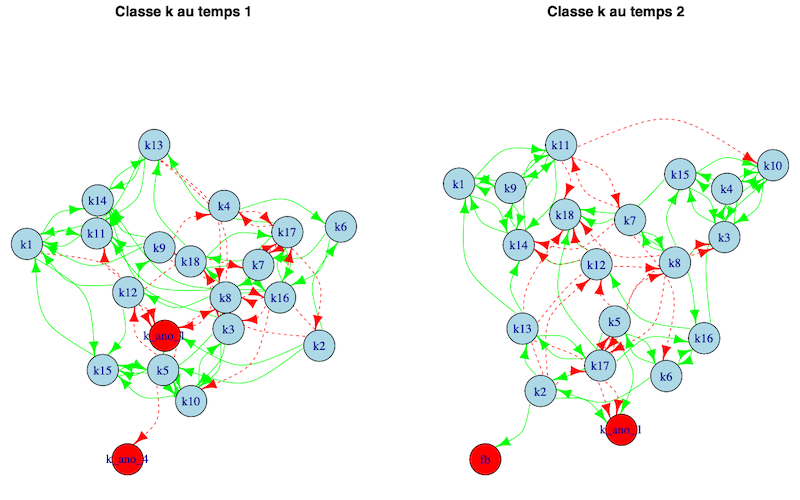

```{r unsplash, include=FALSE}

# libraries----
library(httr) # https://talks.andrewheiss.com/2022-seacen/presentation/#/title-slide
library(jsonlite)
library(tibble)

# préparer les variables----

unsplash_id <- rmarkdown::metadata$unsplash_id

application_id <- rmarkdown::metadata$unsplash_app_id

# préparer les outputs----

# id photo 1

temp_var <- unsplash_id[1]

# se connecter à l'API et nourrir les outputs----

# préparation

api_url <- modify_url("https://api.unsplash.com/",
                      path = paste0("photos/",temp_var),
                      query = paste0("client_id=",application_id)
                      )
api_url

GET(url = api_url)

response <- GET (url = api_url)

d <- content(response, as="text", encoding = "UTF-8")

new <- fromJSON(d)

# image pour slides.

new$urls$regular
# https://api.unsplash.com/photos/xyGR1HKVNpY?client_id=cvtne6r6JhQ2hYh_ZVw80BeNLVrvmDrDqKLP7qOhyyY

# Nom auteur

new$user$name
# "Brooke Cagle"

# URL page

new$links$html
# "https://unsplash.com/photos/AxLrxJz_sKU"

# Loop----

unsplash_db <- tibble(unsplash_url = character(),
                      unsplash_name = character(),
                      unsplash_html = character(),
                      credits = character()
                      )

for (i in 1:length(unsplash_id)) {

  temp_var <- unsplash_id[i]

  api_url <- modify_url("https://api.unsplash.com/",
                        path = paste0("photos/",temp_var),
                        query = paste0("client_id=",application_id)
                        )

  response <- GET (url = api_url)

  d <- content(response, as="text", encoding = "UTF-8")

  new <- fromJSON(d)

  unsplash_db <- add_row(unsplash_db,
                         unsplash_url = new$urls$regular,
                         unsplash_name = new$user$name,
                         unsplash_html = new$links$html,
                         credits = paste0("<br><a href='",new$links$html,"'>",new$user$name,"</a>")
                         )
}


```

```{r setup, include=FALSE}
options(htmltools.dir.version = FALSE)
knitr::opts_chunk$set(
  fig.width=9, fig.height=3.5, fig.retina=3,
  out.width = "100%",
  cache = FALSE,
  echo = FALSE,
  message = FALSE, 
  warning = FALSE,
  fig.show = TRUE,
  hiline = TRUE
)
```

```{r xaringan-themer, include=FALSE, warning=FALSE}
library(xaringanthemer)
style_duo_accent(
  primary_color = "#D2202B",
  secondary_color = "#D2202B",
  inverse_header_color = "#FFFFFF",
  inverse_text_shadow = TRUE,
  title_slide_text_color = "#FFFFFF",
  link_color = "#676C72",
    header_font_google = google_font("Josefin Sans")

)
```

class: hide_logo, inverse, title-slide, bottom
background-image: url(`r unsplash_db$unsplash_url[1]`)
background-size: cover


# `r rmarkdown::metadata$title`

## `r rmarkdown::metadata$subtitle`

### `r rmarkdown::metadata$author` (`r rmarkdown::metadata$team`), `r rmarkdown::metadata$coauthors`

### `r rmarkdown::metadata$date`

<p xmlns:cc="http://creativecommons.org/ns#" xmlns:dct="http://purl.org/dc/terms/">Les slides de présentation par Nicolas Bressoud sont soumises à une licence <a href="http://creativecommons.org/licenses/by-nc/4.0/?ref=chooser-v1" target="_blank" rel="license noopener noreferrer" style="display:inline-block;">CC BY-NC 4.0</a></p>

---

class: center, middle, hide_logo


```{r, echo=FALSE, out.width="70%", fig.cap=""}

```


---
class: left


```{r xaringan-logo, echo=FALSE}
xaringanExtra::use_logo(
  image_url = "img/logo_merged_unif_hep_cheers_rognage.png")
  
```

```{r xaringan-progress-bar, echo=FALSE}
xaringanExtra::use_progress_bar(color = "#D2202B", location = "top", height = "12px")

```


### Thèmes

**Pédagogie spécialisée** et **psychologie positive**

Approche pédagogique basée sur les **forces personnelles** des élèves

Développement du **climat de classe**

Perspectives en contexte d'**inclusion scolaire**

--

### Mots-clés
Forces de caractère (ressources, forces personnelles), Climat de classe, Relations interpersonnelles

--

### Direction de thèse

**Directrice principale :** Pr. Dr. Andrea C. Samson, université de Fribourg

**Co-directrice :** Pr. Dr. Rebecca Shankland, université Lyon Lumière 2

**Co-directeur :** Dr. Philippe Gay, HEP Vaud

---
class: middle left

.pull-left[


### Plan

1. Introduction

1. Design de recherche

1. Matériel pédagogique et méthodologie

1. Résultats

1. Discussion

1. Conclusion


]

.pull-right[

```{r out.width = '80%', echo=FALSE}

if(!file.exists("img/qr.svg"))
  {
  library(qrcode)

  id <- rmarkdown::metadata$github_id
  repo <- rmarkdown::metadata$github_repo

  qr <- paste0("https://",id,".github.io/",repo)

  qr <- qr_code(qr)

  generate_svg(qr, filename = "img/qr.svg")
 
}


```


]
---
class: title-slide, inverse
background-image: url(`r unsplash_db$unsplash_url[2]`)
background-size: cover

# Introduction

---
class: left

# Introduction

*Enseignement en classe hétérogène : le défi de l'inclusion scolaire. [(Pelgrims, 2016)](https://archive-ouverte.unige.ch/unige:91017)*

*Comment enseigner - avec bonheur - à la fois au service de chacun·e et du climat de classe ? [(Bressoud, 2022)](https://www.cairn.info/revue-phronesis-2023-2-page-114.htm)*

--

### Contexte d'inclusion scolaire

Développement des pratiques éducatives inclusives [(Ebersold, 2017)](https://www.cairn.info/revue-francaise-de-pedagogie-2017-4-page-121.htm)

Scolarisation ordinaire à plein temps à proximité du lieu de domicile. [(CSPS, 2023)](https://www.csps.ch/themes/ecole-et-integration/integration-scolaire/reponse-2)

Adaptation de l'école aux besoins des enfants. [(CSPS, 2023)](https://www.csps.ch/themes/ecole-et-integration/integration-scolaire/reponse-2)

--

### Notion de climat de classe

Définie par la qualité des interactions en classe [(Bressoud, Dessibourg, & Gay, 2021)](https://orfee.hepl.ch/handle/20.500.12162/4910)

Influencée par le développement des **interdépendances positives** et du **pouvoir d'agir** [(Bressoud & Gay, 2022)](https://ojs.szh.ch/revue/article/view/1062)

---
class: center, middle

## Interdépendances positives
**et**
## Pouvoir d'agir

---
class: left

# Introduction

*De manière générale, comment soutenir une école inclusive à travers le développement d'un climat scolaire dit positif ?*

*Quelles peuvent être les interventions pertinentes, en particulier dans le champ de la psychologie positive ?*

--

### Psychologie positive

Etude des conditions et processus qui contribuent à l'épanouissement et au fonctionnement optimal des individus, groupes et institutions. [(Gable & Haidt, 2005)](https://journals.sagepub.com/doi/10.1037/1089-2680.9.2.103)

Observation des effets des interventions [(e.g. Carr et al., 2021)](https://www.tandfonline.com/doi/full/10.1080/17439760.2020.1818807)

--

### Forces de caractère

.pull-left[
- Un *trait potentiel* de caractère vertueux et dynamique [(Peterson & Seligman, 2004](https://psycnet.apa.org/record/2004-13277-000); [Waters, 2017)](https://www.penguinrandomhouse.com/books/531910/the-strength-switch-by-lea-waters-phd/)
]

.pull-right[
- Rôle dans le **pouvoir d'agir** et les **interdépendances positives** [(Linkins et al., 2015)](https://www.tandfonline.com/doi/abs/10.1080/17439760.2014.888581)
- Pertinence scolaire [(e.g.,Quinlan et al, 2015)](https://www.tandfonline.com/doi/abs/10.1080/17439760.2014.920407)
]

---

class: center, middle, hide_logo
background-image: url("img/0.png")
background-size: cover


---
class: title-slide, inverse
background-image: url(`r unsplash_db$unsplash_url[3]`)
background-size: cover

# Design de recherche

---
class: left

# Design de recherche
.pull-left[

### Objectif

Observer les effets potentiels des **forces de caractère** sur le **climat de class** en contexte hétérogène.


### Hypothèses

1. Les élèves qui ont eu le programme rapportent une plus grande **utilisation de leurs forces personnelles**

1. Les programme favorise les **interdépendances positives**
]

--

.pull-right[

### Dispositif quasi-expérimental

- Utilisation des forces des profs et élèves [(Govindji & Linley, 2007)](https://www.scirp.org/%28S%28lz5mqp453edsnp55rrgjct55%29%29/reference/referencespapers.aspx?referenceid=2319642)
- Orientation reconnaissante des élèves [(d'après Shankland, 2019)](https://www.cairn.info/la-psychologie-positive--9782100793235-page-157.htm)
- Satisfaction professionnelle des profs [(Fouquereau & Rioux., 2002)](https://psycnet.apa.org/buy/2002-15260-010)


- Rapport à soi et aux autres des élèves (texte libre)
- Rapport aux autres des élèves (sociogramme)
- Evaluation subjective du climat par les profs (texte libre)
]

---
class: title-slide, inverse
background-image: url(`r unsplash_db$unsplash_url[4]`)
background-size: cover

# Matériel pédagogique et méthodologie

---
class: left

# Matériel pédagogique et méthodologie

*By teachers for teachers*

### A chacun ses forces et forts ensemble

.pull-left[
Connaître

Observer chez autrui

Observer chez soi
]

.pull-right[
Utiliser

Célébrer

Signature personnelle des forces
]

--

### Dispositif

Formation continue pour les enseignant·es intéressé·es

Coaching sur 9 semaines à raison de 45 minutes par semaine via le site ["les forces dans ma classe !"](https://bresnico.github.io/les-forces-dans-ma-classe/) et la technologie Microsoft Teams.


---
class: title-slide, inverse
background-image: url(`r unsplash_db$unsplash_url[5]`)
background-size: cover

# Résultats

---
class: left

# Résultats

*Premières explorations sur les 6 classes expérimentales et les 4 classes contrôle.*

### Participation

Profs au temps 1

| Groupe       | N   | Années d'exp. moyenne (SD) | Genre(H/F)           | 
|--------------|-----|-------------------------|-----------------------|
| Expérimental | 6   | 16.0 (10.3)             | 0/6                   |
| Contrôle     | 4   | 17.3 (12.8)             | 0/4                   |

Elèves au temps 1

| Groupe       | N    | Âge moyen (SD) | Genre (Garçons/Filles) |
|--------------|------|----------------|------------------------|
| Expérimental | 105  | 9.8 (1.1)      | 55/48 (2 NA)           |
| Contrôle     | 76   | 9.8 (1.2)      | 42/33 (1 NA)           |

---
class: left

# Résultats

*Scores par groupes et par temps - variables quantitatives*

### Premières explorations des scores - Profs

Profs sur la variable **utilisation des forces**, par temps et par groupe (max : 7)

|           | Groupe contrôle | Groupe expérimental |
|-----------|----------------|---------------------|
| Temps 1   |     M = 5.77, SD = 0.65  (n = 4)   |     M = 5.12, SD = 0.65  (n = 4)     |
| Temps 2   |     M = 5.73, SD = 0.73  (n = 4)   |     M = 5.67, SD = 0.36 (n = 5)    |

Profs sur la variable **satisfaction professionnelle**, par temps et par groupe (max : 7)

|           | Groupe contrôle | Groupe expérimental |
|-----------|----------------|---------------------|
| Temps 1   |     M = 5.74, SD = 0.74  (n = 4)   |     M = 6.05, SD = 0.57   (n = 4)    |
| Temps 2   |     M = 5.50, SD = 0.93  (n = 4)   |     M = 6.12, SD = 0.36   (n = 5)    |

---
class: left

# Résultats

*Scores par groupes et par temps - variables quantitatives*

### Premières explorations des scores - Elèves

Elèves sur la variable **utilisation des forces**, par temps et par groupe (max : 7)

|           | Groupe contrôle | Groupe expérimental |
|-----------|----------------|---------------------|
| Temps 1   | M = 5.50, SD = 0.77   (n = 75)  |     M = 5.05, SD = 1.02    (n = 68)   |
| Temps 2   | M = 5.25, SD = 0.93   (n = 104) |     M = 5.06, SD = 1.11    (n = 104)  |

Elèves sur la variable **orientation reconnaissante**, par temps et par groupe (max : 5)

|           | Groupe contrôle | Groupe expérimental |
|-----------|----------------|---------------------|
| Temps 1   |     M = 4.17, SD = 0.73  (n = 75)   |     M = 4.24, SD = 0.60    (n = 68)   |
| Temps 2   |     M = 4.13, SD = 0.72   (n = 104) |     M = 4.36, SD = 0.59    (n = 104)  |

---
class: left

# Résultats [in progress]

*Premières explorations partielles - variables qualitatives*

### Premières analyses de contenus - Exemple 1

**Temps 1** *Je bouge beaucoup. Je fais de l'équitation. J'adore les balades au galop. Je suis assez doué à l'obstacle. J'aime beaucoup les animaux. Je suis très casse-cou. Je me fais mal tout le temps.*


**Temps 2** *J'ai 11 ans. Je sais bien galoper et sauter. Je me suis amélioré en maths. Je suis courageuse.*

Accords interjuges autour de : 
- scores de langage orienté **forces** et **autrui**
- identification des **contexte** (famille, amis, école, loisirs, soi)
- identification des buts de **performance** ou d'**accomplissement**

---
class: left

# Résultats [in progress]

*Premières explorations partielles - variables qualitatives*

### Premières analyses de contenus - Exemple 2

**Temps 1** *Je suis une fille. J'aime les animaux et ma famille. Mon passe-temps c'est jouer avec ma sœur et jouer au jeu de société avec ma famille. Et je sais pas ce que je sais faire.*


**Temps 2** *Je fais 1,46 m. J'aime bien être avec mes amis. J'aime aider mes amis. Et ce que je sais bien faire c'est dire pardon.*

Accords interjuges autour de : 
- scores de langage orienté **forces** et **autrui**
- identification des **contexte** (famille, amis, école, loisirs, soi)
- identification des buts de **performance** ou d'**accomplissement**
---
class: left

# Résultats [in progress]

*Premières explorations partielles - variables qualitatives*

### Premières analyses de contenus 


```{r, echo=FALSE, out.width="50%", fig.align="center", fig.cap="Comparaison temps 1 - temps 2 pour la classe K"}

```

---
class: left

# Résultats [in progress]

*Premières explorations partielles - variables qualitatives*

### Prochaines analyses

- Finalisation de l'évaluation des **351** items **élèves** avec **3** juges
- Scoring des relations à partir des **sociogrammes**
- Discussion avec les **retours qualitatifs** des profs
- Exploration selon les **patterns** profs - élèves

---
class: title-slide, inverse
background-image: url(`r unsplash_db$unsplash_url[6]`)
background-size: cover

# Discussion

---
class: left

# Discussion

### Premières interprétations

Les effets ne sont pas visibles à travers les premiers tests statistiques chez les élèves (ANOVA à mesures répétées)

Les tendances vont dans le sens des hypothèses, ce qui est étonnant et encourageant compte tenu des biais en particlier dans les classes contrôle

Toutes choses étant égales par ailleurs, en nous basant sure les retours des profs, les **forces de caractère** semblent être un outil pertinent à la condition de l'utiliser au service d'un projet explicite (pas d'effet probable de *l'outil pour l'outil*).

.pull-left[
### Limites

- Validité des échelles utilisées
- Prudence dans les interprétations

]

.pull-right[

### Perspectives

- Intérêt pédagogique d'un outil *fait par et pour les enseignants
- Focus sur la climat scolaire en milieu inclusif
- Observation de l'enfant
]
---
class: title-slide, inverse
background-image: url(`r unsplash_db$unsplash_url[7]`)
background-size: cover

# Conclusion

---
class: center, middle

# Conclusion

Il y a un intérêt prépondérant à former et contribuer à outiller les enseignants dans la prise en compte de l'**hétérogénéité**.

Le développement des politiques **inclusives** passe par le renforcement des **interdépendances positives** et du **pouvoir d'agir** de toutes les personnes.

La manière de percevoir la différence, notamment avec les **forces de caractère**, a son rôle à jouer.

La démarche du **design by teachers for teachers** est un levier de la formation.

---

class: middle

.left[


## &#x1F64F; Merci !

]

--

.right[


Crédits Photo par ordre d'apparition :

`r unsplash_db$credits`

]
